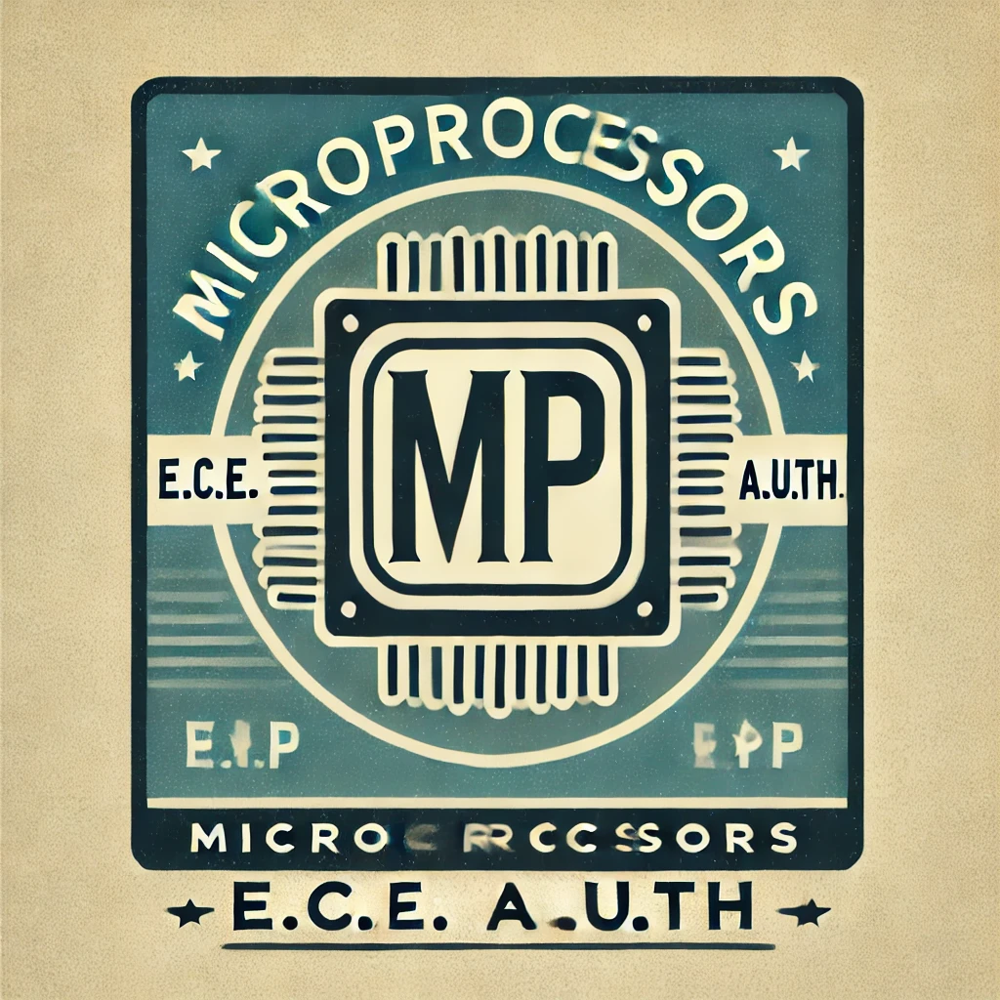

# Microprocessors

)

> Logo designed by AI: DALLE, just like the rest of my course repository icons.

The code in this repository was developed by:
- Georgios Selivanof ([@Selivanof](https://github.com/Selivanof))
- Lamprinos Chatziioannou

# Description
Essentially this repository tracks our team's approach to the microprocessors course, taught by professor [Ioannis Papaefstathiou](https://ece.auth.gr/staff/ioannis-papaefstathiou-2/), during the 8th semester of the E.C.E. A.U.Th. study program.

There is also a folder with notes and helpful material ([check it out](notes))

# Contents
- [Lab 1](lab1): This was about writing in assembly, utilizing assembly within c and using UART to print information.
- [Lab 2](lab2): This was about reading input through UART and handling interrupts through customized ISRs.
- [Lab 3](lab3): Building on the previous labs, this was about using ISRs, and UART to collect temperature information from the given sensor. The behaviour was affected by user input.

